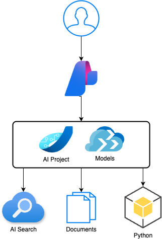

# Intune Assistant Chatbot

A RAG-based chatbot built with Azure AI Foundry and Azure Cognitive Search that helps
IT support teams and employees navigate Microsoft Intune — device enrollment, compliance
policies, and troubleshooting.

Built as a hands-on learning project during the Microsoft AI Skills Fest, combining
real Intune knowledge with Python, Azure AI, and RAG architecture.

---

## Scenario

The chatbot is scoped to a fictional company, **Skyline Dynamics**, standing up Intune
for the first time. It retrieves internal documentation and Intune policy information
at runtime to ground responses — no static Q&A pairs, no hallucinated policy details.

---

## Architecture

| Layer | Technology |
|-------|------------|
| Frontend | Copilot SDK chatbot interface |
| Backend | Azure AI Foundry SDK + Python |
| Retrieval | RAG — documents retrieved at runtime via vector search |
| Search | Azure Cognitive Search |
| Observability | OpenTelemetry + Application Insights |

---

## How It Works

1. Internal Intune documentation is indexed into Azure AI Search using vector embeddings
2. At runtime, the user's query is converted to a vector and matched against the index
3. Relevant documents are retrieved and passed as context to the Azure OpenAI model
4. The model generates a response grounded in the retrieved content
5. Traces are captured via Application Insights for observability and debugging

---

## Technologies

| Tool | Purpose |
|------|---------|
| Python | Core application language |
| Azure AI Foundry SDK | Project configuration, model deployment, RAG orchestration |
| Azure Cognitive Search | Document indexing and semantic/vector retrieval |
| Azure OpenAI Service | LLM for response generation |
| Azure Prompty | Custom intent mapping |
| OpenTelemetry + Application Insights | Tracing and observability |
| VS Code | Development environment |
| GitHub | Version control |

---

## What I Built and Learned

- Configured an Azure AI Foundry project end to end
- Indexed internal documentation into Azure AI Search with vector embeddings
- Built a custom intent mapping model using Azure Prompty files
- Implemented semantic search with vector embeddings for retrieval
- Added Application Insights tracing for observability
- Debugged Azure OpenAI deployment errors including invalid URL issues with the `/v1/chat/completions` endpoint
- Built a complete RAG pipeline grounded in a real business scenario

---

## Reference Resources

- [Build a custom knowledge retrieval (RAG) app with Azure AI Foundry SDK](https://learn.microsoft.com/en-us/azure/ai-foundry/tutorials/copilot-sdk-create-resources?tabs=macos)
- [Create an Azure AI Search service](https://learn.microsoft.com/en-us/azure/search/search-create-service-portal)
- [Trace your application with Azure AI Foundry SDK](https://learn.microsoft.com/en-us/azure/ai-foundry/how-to/develop/trace-local-sdk?tabs=python)
- [Azure OpenAI invalid URL error fix](https://stackoverflow.com/questions/75882988/openai-gpt-3-api-error-invalid-url-post-v1-chat-completions)

---

## Related Projects

- [azure-infrastructure-labs](https://github.com/shevonnepolastre/minecraft-azure-quests) — AZ-104 lab environment covering identity, storage, compute, networking, and monitoring
- [azure-hub-spoke-platform](https://github.com/shevonnepolastre/azure-hub-spoke-platform) — enterprise hub-and-spoke network architecture in Bicep
- [minecraft-azure-server](https://github.com/shevonnepolastre/minecraft-azure-server) — automated Minecraft server deployment on Azure using GitHub Actions and Bicep
